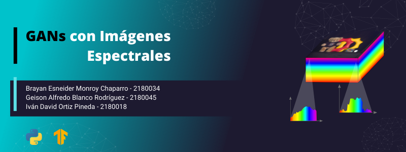

# GANs con Imágenes Espectrales

Las imágenes espectrales contienen la información espacial y espectral de una escena, esta información espectral es de gran utilidad en áreas como el censado remoto, la detección de materiales o la agricultura de precisión. Sin embargo, la adquisición de este tipo de imágenes es un problema desafiante debido a la alta dimensionalidad de las mismas. En los últimos años enfoques basados en aprendizaje profundo han explorado técnicas para la adquisición de este tipo de imágenes ofreciendo buenos resultados al evaluarse en un conjunto de datos especifico. A su vez, este tipo de enfoques deben contar con un conjunto de datos ya preexistente para poder explotar al máximo las capacidades de los modelos de redes neuronales y debido a la alta dimensionalidad de este tipo de imágenes, nos encontramos con un problema de escasez de datos. 

Basados en el hecho de que una imagen espectral puede mapearse a una imagen RGB mediante el uso de un espacio de color definido matemáticamente, el presente trabajo haciendo uso de redes generativas adversarias busca resolver el problema inverso, es decir, a partir de una imagen RGB obtener la imagen espectral asociada, permitiendo generar y construir nuevos conjuntos de datos de imágenes espectrales a partir de imágenes RGB.

[Codigo](https://github.com/bemc22/spectral-gans) | [Video](https://drive.google.com/file/d/1n8R0v5nHzd50XxuVdNP4iFXYuNrLz5oO/view?usp=sharing) | [Dataset](http://vclab.kaist.ac.kr/siggraphasia2017p1/kaistdataset.html)
